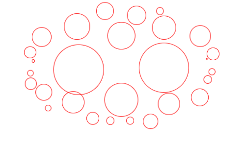

# circle-packing

This template should help get you started developing with Vue 3 in Vite.



## example

```vue
<script setup>
  const data = [
    {
      "name": "Drama",
      "value": 1046790
    },
    {
      "name": "Drama",
      "value": 1046790
    },
    {
      "name": "more",
      "value": 1046790
    }
  ]
</script>

<template>
  <div style="width: 500px;height: 300px;background-color: white">
    <CirclePacking animate :data="data">
      <template #default="{item}">
        {{item.name}}
      </template>
    </CirclePacking>
  </div>
</template>
```

## Recommended IDE Setup

[VSCode](https://code.visualstudio.com/) + [Volar](https://marketplace.visualstudio.com/items?itemName=Vue.volar) (and disable Vetur).

## Type Support for `.vue` Imports in TS

TypeScript cannot handle type information for `.vue` imports by default, so we replace the `tsc` CLI with `vue-tsc` for type checking. In editors, we need [Volar](https://marketplace.visualstudio.com/items?itemName=Vue.volar) to make the TypeScript language service aware of `.vue` types.

## Customize configuration

See [Vite Configuration Reference](https://vite.dev/config/).

## Project Setup

```sh
npm install
```

### Compile and Hot-Reload for Development

```sh
npm run dev
```

### Type-Check, Compile and Minify for Production

```sh
npm run build
```

### Lint with [ESLint](https://eslint.org/)

```sh
npm run lint
```
